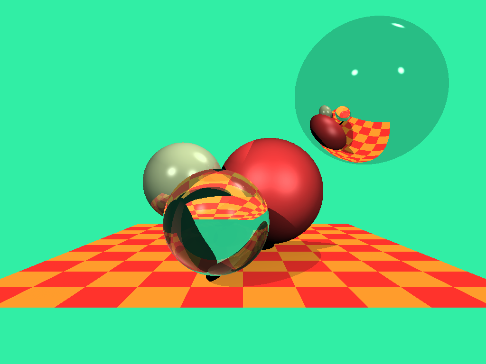

# tinyraytracer-C

It is inspired from [tinyraytracer](https://github.com/ssloy/tinyraytracer) by [ssloy](https://github.com/ssloy) which is written in C++. This is a C version of it. It is a very good tutorial for beginners to learn ray tracing. I have tried to keep the code as close to the original as possible. I have also added some comments to make it easier to understand. I have also added a Makefile to make it easier to compile and run.



## Requirements

-   git
-   C compiler
-   Make

## How to compile and run

If you have gcc and make installed, then you can simply run the following commands:

```bash
git clone https://github.com/Qazalbash/tinyraytracer-C.git
make
./tinyraytracer
```

Otherwise, you can compile it manually:

```bash
git clone https://github.com/Qazalbash/tinyraytracer-C.git
gcc -Wall -Wextra -g -O -fopenmp -o tinyraytracer tinyraytracer.c -lm
./tinyraytracer
```

## Future work and improvements

There are many things that can be improved in this code. The first and foremost thing is to make it more optimized. I have tried to make it as optimized as possible, but there is still a lot of room for improvement. One aspect is to less use static variables and use dynamic memory allocation instead. I am also planning to make this in OpenCL and CUDA.
